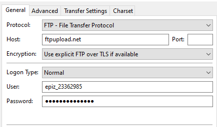

# bb4-website

This repository contains the content for [http://barrybecker4.org](http://barrybecker4.org). 

## Steps to deploy (using Github Pages)

Simply commit content to /source/html/barrybecker4 and it will appear at https://barrybecker4.org.

### Cloudflare Web Analytics

GitHub Pages is served directly from GitHub, not through Cloudflare's proxy, so the dashboard "Enable" (auto-inject) option does not work for this site. Use manual snippet installation instead:

1. In Cloudflare **Observability → Web Analytics → Manage site**, choose **Enable with JS Snippet installation** and copy the `token` value from the snippet.
2. Add a GitHub repository secret named `CF_WEB_ANALYTICS_TOKEN` with that token value.
3. Push to `master` (or run the deploy workflow manually). The deploy workflow injects the beacon into all HTML pages before publishing.

To verify locally after setting the token:

```bash
CF_WEB_ANALYTICS_TOKEN='your-token' python3 scripts/inject_cloudflare_analytics.py source/html/barrybecker4
```

The scala software projects can be generated from respective bb4 projects. There is a `deploy` task in each which will produce a `dist` directory - the contents of which can then be copied into barrybecker4/bb4-projects.

### Library dependencies

Here is the dependency structure of the bb4 projects. Each is built independently and deployed to Sonatype maven repository.


       bb4-math    __bb4-common______
             \   /                   \
            bb4-ui             bb4-sound     bb4-A-star
             |                  /  \___________________________________
        bb4-optimization      /     /    \       \      \              \
          /          \      /      /      \       \     bb4-adventure  bb4-aikido-app
    bb4-imageproc     \    /      /        \       \    
      |         bb4-experiments  /          \       \      bb4-expression
      |                         /            \       \       /
      |                   bb4-puzzles   bb4-games    bb4-simulations  
     bb4-image-breeder


All modules are open-source projects in github (https://github.com/bb4)
Pure library projects are `bb4-common`, `bb4-math`, `bb4-expression`, `bb4-ui, bb4-sound`, `bb4-A-star`, `bb4-optimization`, `bb4-imageproc`.

### Additional notes
I split out jigo (used by go) and jhlabs (used by image breeder) into separate gradle projects which build separate
jars because they are based on other people's open source code. In the rare case that you need to modify the source in
these jars, get them using the following.
- git clone https://github.com/barrybecker4/jhlabs.git
- git clone https://github.com/barrybecker4/bb4-sgf.git

## Old Steps to deploy (using InfinityFree)

Use Filezilla (or similar) to copy everything (or changed parts) in source/html to the root of http://barrybecker4.org.
Don't change anything directly on the website itself. Change and test locally before deployment.



The applications from different `bb4` projects can be deployed to the `bb4-projects` subdirectory under the root of the website. Each project has a gradle "deploy" task that will put everything in a local `dist` directory that can then be ftp'd to the website using Filezilla. If you want to test locally before deploying to the live site, you can copy the bb4-common deployment to the local dist directory so that common files can be found locally.

